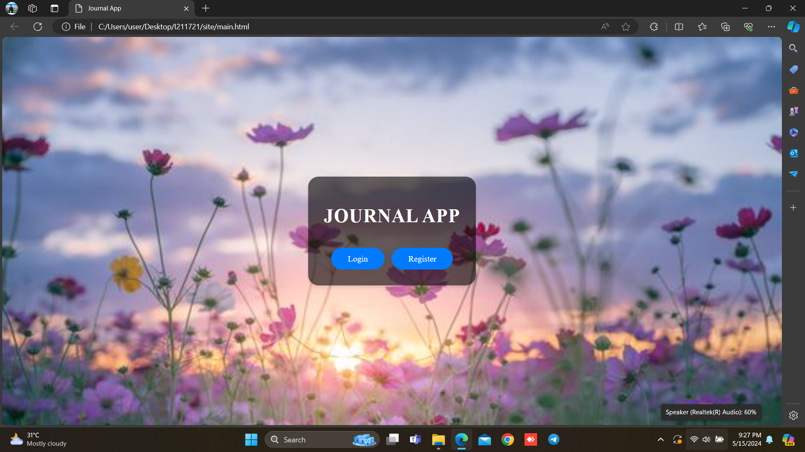
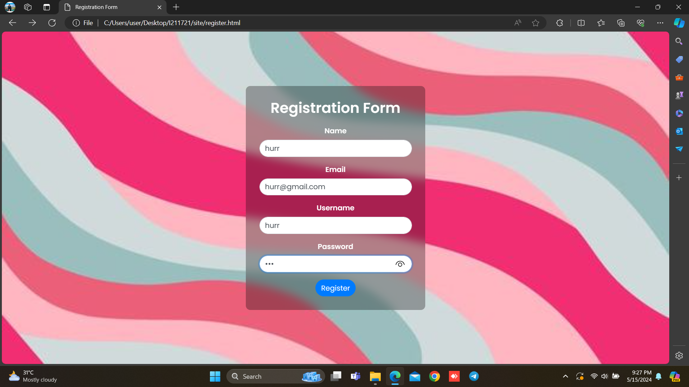
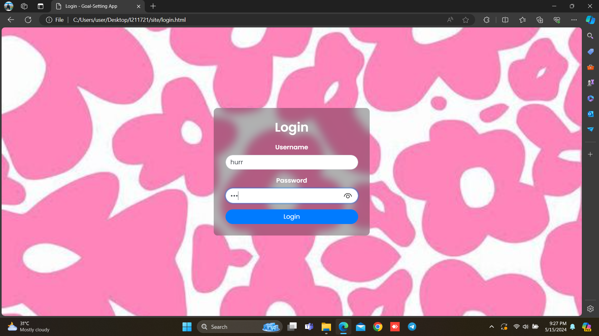
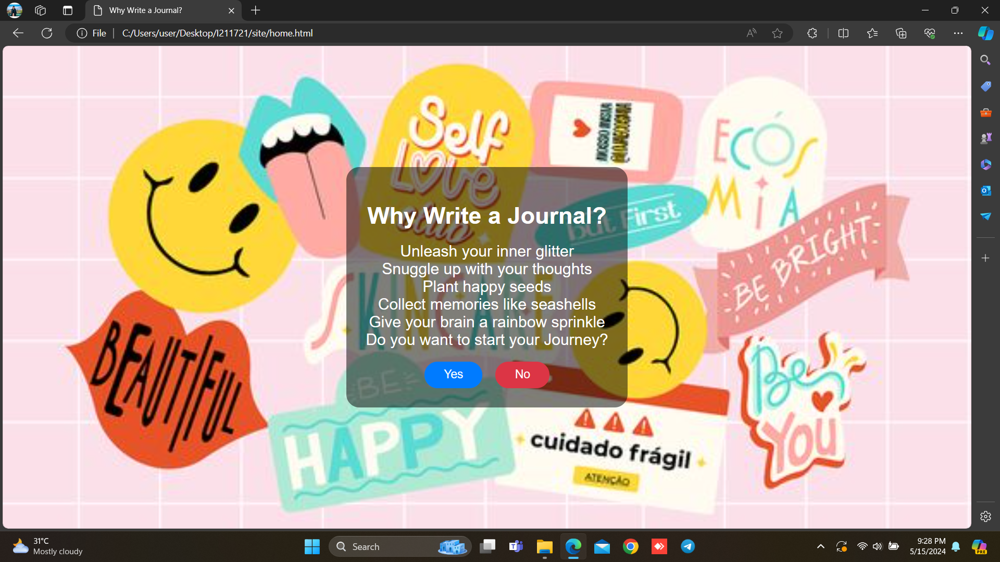
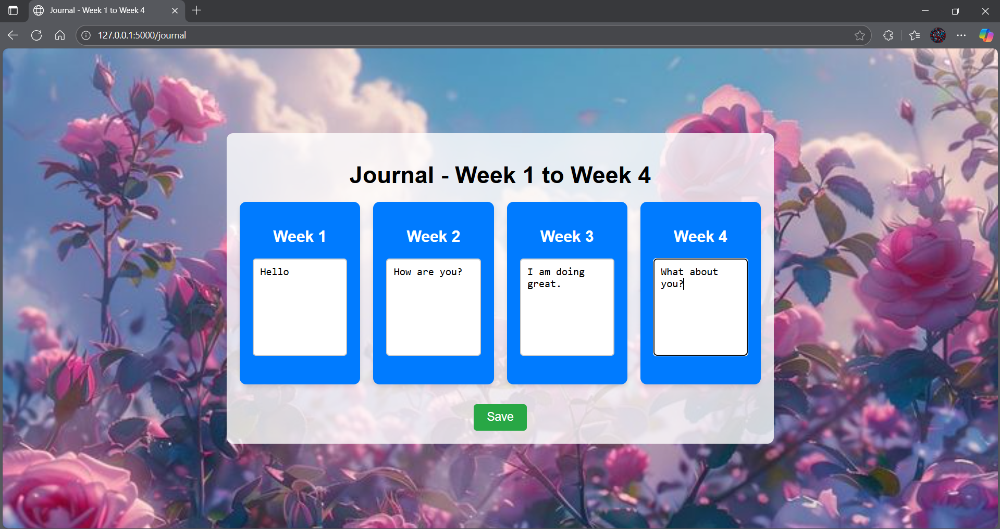
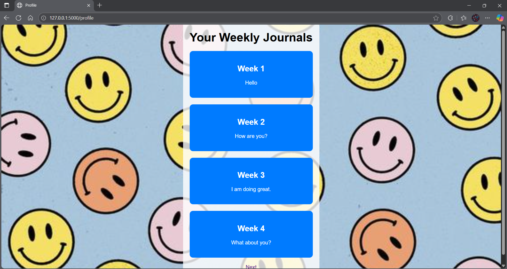

# Journal App

A simple web-based journaling application built with Flask and Bootstrap. Users can register, log in, write weekly journals, and view their entries in a visually appealing interface.

## Features

- User registration and login
- Weekly journal entry (Weeks 1–4)
- Profile page displaying journal entries
- Motivational home page
- Responsive design with attractive backgrounds
- All data stored in browser local storage (no backend database)

## Project Structure

```
backend.py
static/
    pic1.jpg
    pic2.jpg
    pic3.jpg
    pic4.jpg
    pic5.jpg
    pic6.jpg
    pic7.jpg
templates/
    end.html
    home.html
    journal.html
    login.html
    main.html
    profile.html
    register.html
.vscode/
    settings.json
```

- `backend.py`: Flask backend serving HTML templates.
- `static/`: Contains background images for the app.
- `templates/`: HTML templates for each page.
- `.vscode/`: VS Code settings.

## Getting Started

### Prerequisites

- Python 3.x
- Flask

### Installation

1. Clone the repository:
    ```sh
    git clone https://github.com/yourusername/journal-app.git
    cd journal-app
    ```

2. Install Flask:
    ```sh
    pip install flask
    ```

### Running the App

Start the Flask server:

```sh
python backend.py
```

Visit [http://127.0.0.1:5000/](http://127.0.0.1:5000/) in your browser.

## Usage

- **Register**: Create a new account.
- **Login**: Access your journal.
- **Home**: Motivational introduction.
- **Journal**: Write entries for each week.
- **Profile**: View your saved journals.
- **End**: Completion message.

> **Note:** All user and journal data is stored in your browser's local storage. No data is stored on the server.

## Screenshots














